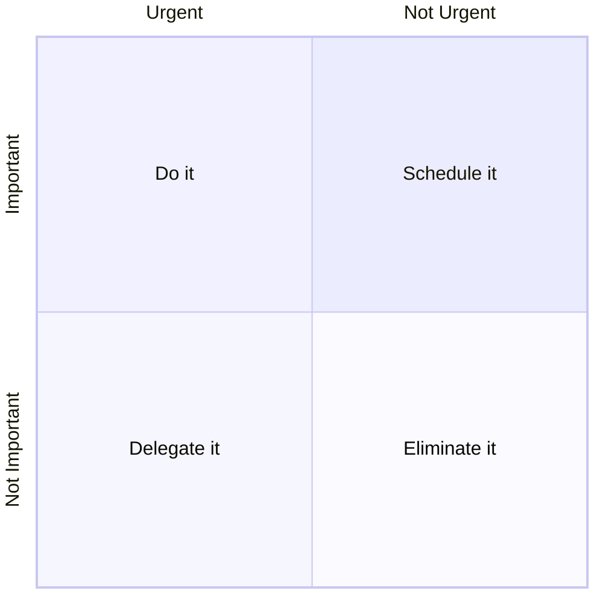

# Productivity

## 3/3/3 Method

From Oliver Burkeman. Do these Daily:

- Spend 3 hours working on an important project.
- Complete 3 shorter urgent tasks or meetings.
- Do 3 maintenance tasks to keep life running smoothly.

## Cult of Done Manifesto

1. There are three states of being. Not knowing, action and completion.
2. Accept that everything is a draft. It helps to get it done.
3. There is no editing stage.
4. Pretending you know what you're doing is almost the same as knowing what you are doing, so just accept that you know what you're doing even if you don't and do it.
5. Banish procrastination. If you wait more than a week to get an idea done, abandon it.
6. The point of being done is not to finish but to get other things done.
7. Once you're done you can throw it away.
8. Laugh at perfection. It's boring and keeps you from being done.
9. People without dirty hands are wrong. Doing something makes you right.
10. Failure counts as done. So do mistakes.
11. Destruction is a variant of done.
12. If you have an idea and publish it on the internet, that counts as a ghost of done.
13. Done is the engine of more.

## Eat the Frog

Do your hardest task first. The rest will be easier.

> "If it's your job to eat a frog, it's best to do it first thing in the morning. And if it's your job to eat two frogs, it's best to eat the biggest one first." - Mark Twain

## Eisenhower Matrix

## Pomodoro Technique

1. List your tasks
2. Set a 25 minute timer
3. Focus and work
4. Take a 5 minute break
5. Repeat 4 times, then break for longer

## Seinfeld Strategy

1. Set your goal
2. Mark a calendar each day you do it
3. Keep the streak as long as you can
4. Never miss 2 days in a row

## Time Blocking

1. Identify what needs doing
2. Group similar activities together
3. Assign time slots for tasks
4. Plot blocks on a calendar
5. Stick to the schedule
6. Take breaks between blocks
7. Make changes if needed

## 5 Hour Rule

Devote one hour a day, five days a week, to learning something new.

## References

- Bre Pettis and Kio Stark,[_Cult of Done Manifesto_](http://brepettis.com/work-avenue#/cultofdone/), 2009
