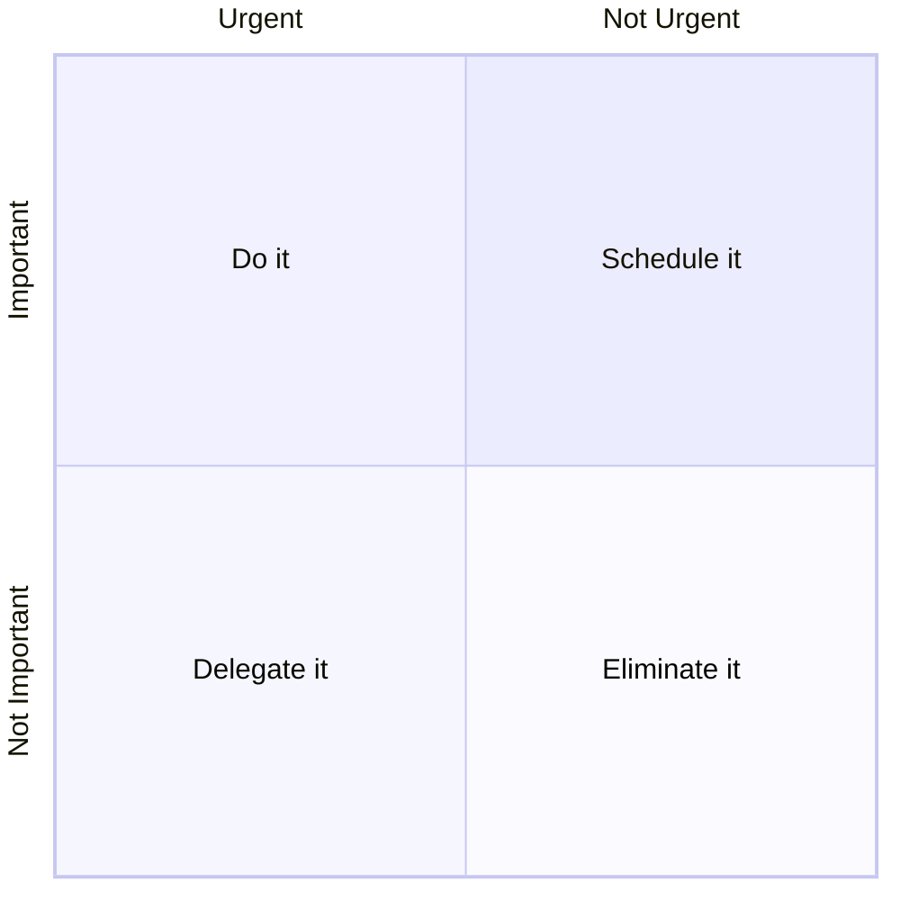

# Productivity

## 3/3/3 Method

From Oliver Burkeman. Do these Daily:

- Spend 3 hours working on an important project.
- Complete 3 shorter urgent tasks or meetings.
- Do 3 maintenance tasks to keep life running smoothly.

## Cult of Done Manifesto

1. There are three states of being. Not knowing, action and completion.
2. Accept that everything is a draft. It helps to get it done.
3. There is no editing stage.
4. Pretending you know what you're doing is almost the same as knowing what you are doing, so just accept that you know what you're doing even if you don't and do it.
5. Banish procrastination. If you wait more than a week to get an idea done, abandon it.
6. The point of being done is not to finish but to get other things done.
7. Once you're done you can throw it away.
8. Laugh at perfection. It's boring and keeps you from being done.
9. People without dirty hands are wrong. Doing something makes you right.
10. Failure counts as done. So do mistakes.
11. Destruction is a variant of done.
12. If you have an idea and publish it on the internet, that counts as a ghost of done.
13. Done is the engine of more.

## Eat the Frog

Do your hardest task first. The rest will be easier.

> "If it's your job to eat a frog, it's best to do it first thing in the morning. And if it's your job to eat two frogs, it's best to eat the biggest one first." - Mark Twain

## Eisenhower Matrix

## Pomodoro Technique

1. List your tasks
2. Set a 25 minute timer
3. Focus and work
4. Take a 5 minute break
5. Repeat 4 times, then break for longer

## Seinfeld Strategy

1. Set your goal
2. Mark a calendar each day you do it
3. Keep the streak as long as you can
4. Never miss 2 days in a row

## Time Blocking

1. Identify what needs doing
2. Group similar activities together
3. Assign time slots for tasks
4. Plot blocks on a calendar
5. Stick to the schedule
6. Take breaks between blocks
7. Make changes if needed

## 5 Hour Rule

Devote one hour a day, five days a week, to learning something new.

## PAL Meetings

- **Purpose:** Determine the purpose of the meeting and make sure everyone understands it.
- **Agenda:** Circulate the topics to be covered in service of that purpose.
- **Limit:** Set guidelines for how long the meeting and agenda items will take.

## 10 Rules for Good Remote Meetings

1. Question whether the meeting should happen in the first place
2. Cancel unnecessary meetings
3. Make meeting attendance optional and record meetings to encourage asynchronous participation
4. Start on time and end on time with the "speedy meetings" setting in Google Calendar
5. Ensure every meeting has an agenda - "no agenda, no attenda"
6. Document everything live in the agenda notes
7. Use the right tools
8. Avoid hybrid calls (in-person and online) to level the playing field
9. Unique surrounding should be celebrated, no need to have your background look 'professional'
10. Empower team members to be the manager of their attention; it's okay to work on other tasks if a particular portion of a meeting doesn't apply to you

## Getting in the flow

The nine dimensions of flow are:

1. Challenge-skills balance
2. Total concentration
3. Clear goals
4. Immediate feedback
5. Transformation of time
6. Feeling intrinsically rewarded
7. Effortless
8. Loss of self-consciousness
9. Feeling of total control

The follow actions can help achieve a flow state:

1. Optimise your environment
   a. Block focus time
   b. Schedule breaks
   c. Snooze Slack and phone notifications
   d. Eliminate or reduce multitasking
   e. Invest in noise-cancelling headphones
   f. Get comfortable
   g. Be mindful of meeting frequency when scheduling
   h. Create a pre-flow ritual that cues your brain for work
2. Map out your work
   - Have a clear path for accomplishing your goal
   - Strive for a good balance of challenging work - not too easy or too stressful
3. Find joy in the work you're doing
   - Clearly articulating outcomes can increases motivation to take on work and do it quickly
   - Rethink why your doing a piece of work in the first place if not enjoyable

## References

- Bre Pettis and Kio Stark,[_Cult of Done Manifesto_](http://brepettis.com/work-avenue#/cultofdone/), 2009
- [How to fix everything that's wrong with your meetings](https://www.fastcompany.com/90977309/how-fix-everything-thats-wrong-with-meetings?trk=feed_main-feed-card_feed-article-content), Kathleen Davis
- [10 ways to do remote meetings right](https://www.linkedin.com/feed/update/urn:li:activity:7156783152638660608/), Sid Sijbrandij
- [Flow: The Psychology of Optimal Experience] by Mihaly Csikszentmihalyi
- [How to get in the flow while coding (and why it’s important)](https://github.blog/2024-01-22-how-to-get-in-the-flow-while-coding-and-why-its-important/)
